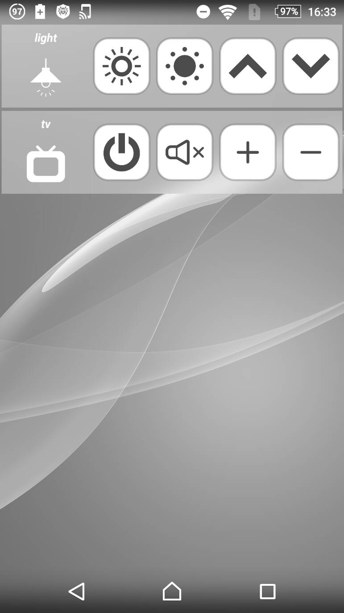

Nature Remo Android Widget
====

 # 概要

## 説明
Nature RemoのAndroid用のウィジェットです。
ホーム画面からNature Remoを操作できるようになります。

## Install
アプリのみインストールしたい方はproductフォルダ内のNatureRemoWidget.apkをスマートフォンにインストールしてください。

Android Studioでプロジェクトを読み込んでビルドすることもできます。

## Usage

ホーム画面にウィジェットを追加すると設定画面が開かれます。
初回起動時には権限の確認とトークンの設定画面が開かれます。

[home.nature.global](https://home.nature.global/)よりアクセストークンを作成してトークンの設定画面に入力してください。

トークンを設定することで自身がNature Remoに登録したボタン一覧を取得し、設定することができます。

## Licence
MIT