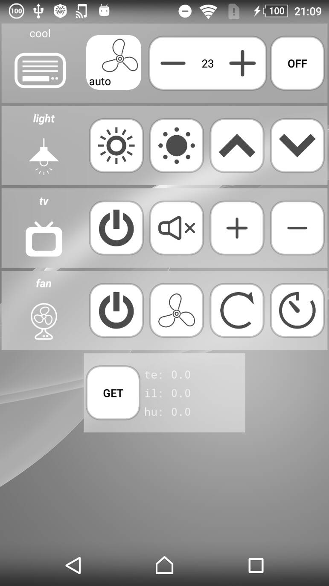
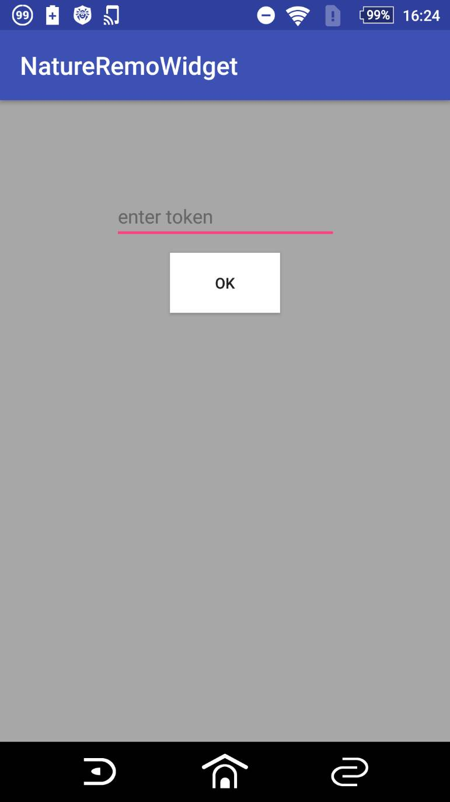

Nature Remo Android Widget
====

# 概要

## 説明
Nature RemoのAndroid用のウィジェットです。
ホーム画面からNature Remoを操作できるようになります。

## Install
アプリのみインストールしたい方はproductフォルダ内のNatureRemoWidget.apkをスマートフォンにインストールしてください。

Android Studioでプロジェクトを読み込んでビルドすることもできます。

注意：スマートフォンの設定でバッテリーの最適化をしているとうまく動かないことがあります。
その場合はこのアプリを最適化しないように設定してください。

## Usage

ウィジェットは
エアコンウィジェット、リモコンウィジェット、モニターウィジェットの
3つあります。

エアコンウィジェットはエアコン用のウィジェットです。
Nature Remoでもエアコンは他の家電とは別に設定したと思います。
エアコンとその他の家電ではapiが異なるので別にしています。

リモコンウィジェットはエアコン以外の家電用ウィジェットです。

モニターウィジェットは部屋の温度、湿度、照度を取得するためのウィジェットです。

エアコンウィジェット、リモコンウィジェット
をホーム画面に追加すると設定画面が開かれます。
初回起動時にはトークンの設定画面が開かれます。

[home.nature.global](https://home.nature.global/)よりアクセストークンを作成してトークンの設定画面に入力してください。

トークンを設定することで自身がNature Remoに登録したボタン一覧を取得し、設定することができます。

エアコンウィジェット設定画面では操作したいエアコンを選んでください。

リモコンウィジェット設定画面では家電のアイコン、
それぞれのボタンのアイコンと送信したい信号を選んでください。

## Licence
MIT